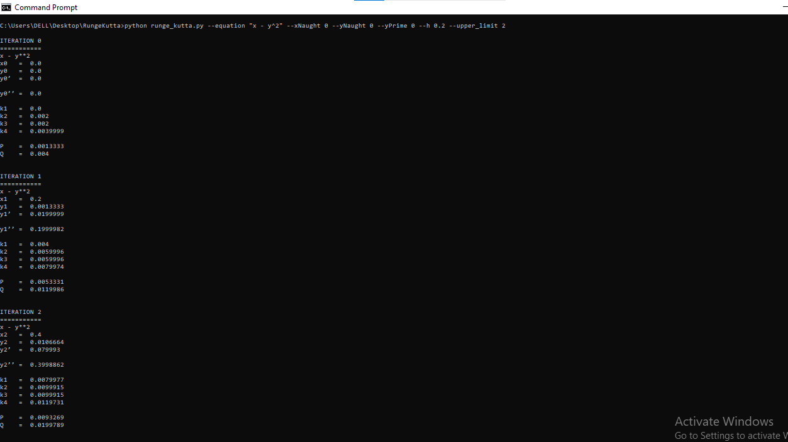

# Second-Order Differential Equation Solver



A Python command-line script for solving second-order differential equations using the Runge-Kutta method.

## Features

- Solve second-order differential equations numerically.
- Adjustable time step and initial conditions.
- Prints the result on the console.

## Getting Started

These instructions will help you get a copy of the project up and running on your local machine.

### Prerequisites

To run this project, you'll need:

- Python3.x (3.9+ recommended) installed on your system.

### Installation

1. Clone the repository to your local machine:

   ```bash
   git clone https://github.com/farookie007/RungeKutta.git

   ```

2. Navigate to the project directory:

   ```bash
   cd RungeKutta
   ```

### Usage

To solve a secod-order differential equation, follow these steps:

1. Open your terminal or command prompt

2. Navigate to the project directory

   ```bash
   cd RungeKutta

   ```

3. Run the script with the desired parameters. Example:

   ```bash
   python runge_kutta.py --equation "x - y^2" --xNaught 0 --yNaught 0 --yPrime 0 --h 0.2 --upper_limit 2

   - Replace  "x - y^2" with your second-order differential equation.
   - Modify the other parameters with your initial conditions.
   - Adjust the time step (--time_step) as needed.

   ```

4. The script will solve the differential equation using the Runge-Kutta method and print the results after each iteration to the console.

## License

This project is licensed under the GNU GENERAL PUBLIC LICENSE - see the [LICENSE.md](LICENSE.md) file for details.

## Acknowledgments

- Inspired by my laziness in solving Runge-Kuttal equations by hand and later realizing I made error at the second iteration.
- Also, acknwledge my lecturer in Engineering Mathematics.
